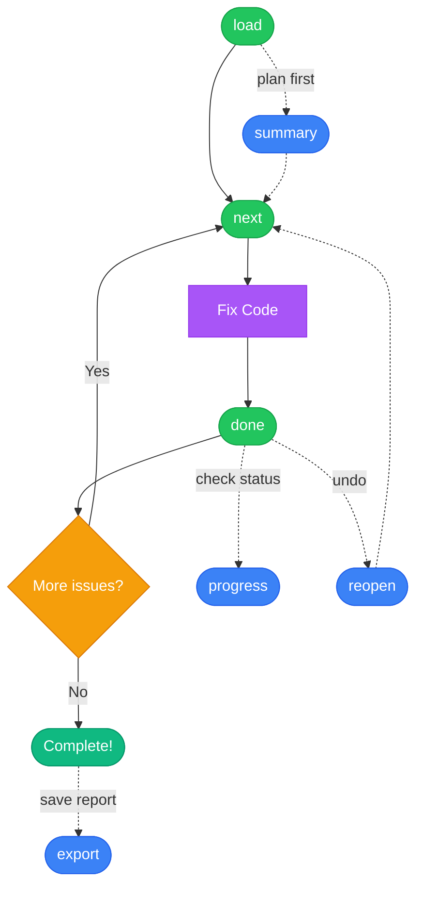

import { Aside } from '@astrojs/starlight/components';

Sheriff exposes a single unified `sheriff` tool with multiple actions. This design minimizes tool discovery overhead while providing full functionality.

## Tool Structure

All Sheriff operations use this format:

```json
{
  "action": "<action_name>",
  "target": "<optional_target>",
  "scope": { /* optional filters */ },
  "limit": 25  // optional, only for 'next'
}
```

## Available Actions

| Action | Description | When to Use |
|--------|-------------|-------------|
| [**load**](/sheriff-mcp/tools/load/) | Load a SARIF file and get overview statistics | Start of session, or after restart to restore progress |
| [**next**](/sheriff-mcp/tools/next/) | Get the next batch of issues (grouped by file) | Ready to fix issues in the next file |
| [**done**](/sheriff-mcp/tools/done/) | Mark issues as fixed or skipped | After fixing all issues in a file |
| [**progress**](/sheriff-mcp/tools/progress/) | Check current session progress | To report status or verify completion |
| [**summary**](/sheriff-mcp/tools/summary/) | Get breakdown by rule, severity, and file | Planning which issues to tackle first |
| [**reopen**](/sheriff-mcp/tools/reopen/) | Undo fixed/skipped marks | Made a mistake or need to revisit an issue |
| [**export**](/sheriff-mcp/tools/export/) | Export remaining issues to a file | Handoff to another agent or create a report |

## Scope Filtering

The `next`, `progress`, and `export` actions support scope filtering to narrow down issues:

```json
{
  "rule": "ConstantValue",      // Exact match or wildcard: "Constant*"
  "severity": "High",           // High, Moderate, or Low
  "file": "src/**/*.java"       // Glob pattern
}
```

### Examples

Filter by rule:
```json
{"action": "next", "scope": {"rule": "ConstantValue"}}
```

Filter by severity:
```json
{"action": "next", "scope": {"severity": "High"}}
```

Filter by file pattern:
```json
{"action": "next", "scope": {"file": "src/main/**/*.java"}}
```

Combine filters:
```json
{"action": "next", "scope": {"rule": "unused*", "severity": "Moderate"}}
```

## Response Format

All responses use abbreviated field names to minimize token usage:

| Field | Meaning |
|-------|---------|
| `fp` | Fingerprint (unique issue ID) |
| `loc` | Location (line:column) |
| `msg` | Message |
| `sev` | Severity (H/M/L) |
| `snip` | Code snippet |
| `rem` | Remaining issues |
| `remF` | Remaining files (in `next` response) |
| `filesRem` | Remaining files (in `progress` response) |
| `prog` | Progress object |

<Aside type="tip">
The abbreviated format reduces context usage by ~40% compared to verbose field names.
</Aside>

## Workflow Overview



**Core loop:** `load` → `next` → fix code → `done` → repeat until `remaining = 0`

**Optional actions:**
- `summary` — Plan which issues to tackle first
- `progress` — Check how many issues remain
- `reopen` — Undo a fixed/skipped mark
- `export` — Save remaining issues to file
